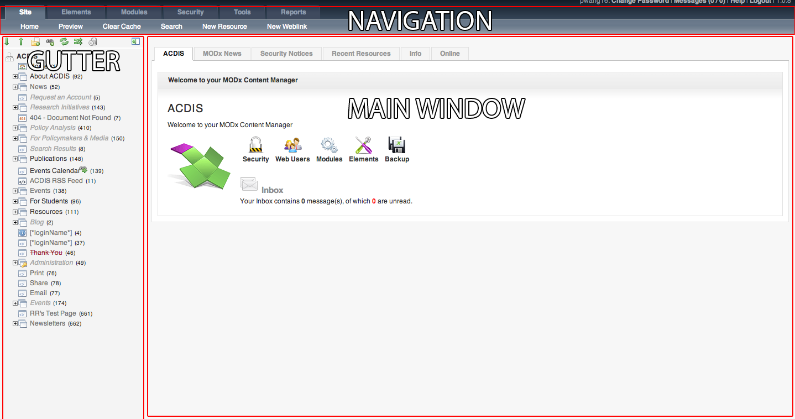
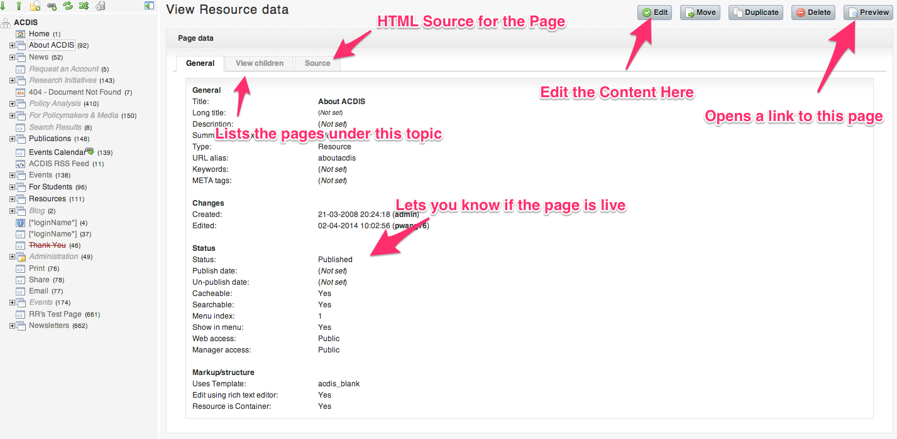
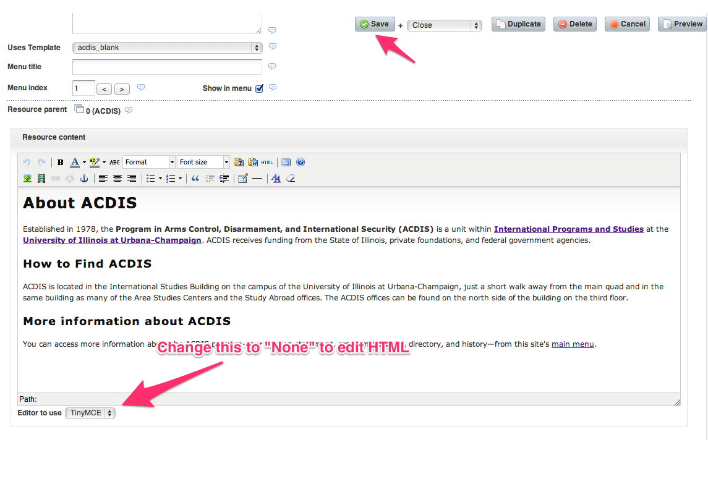
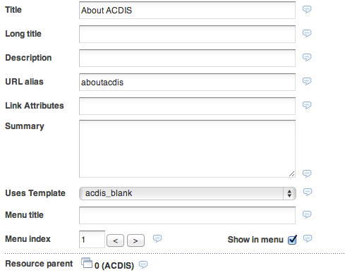
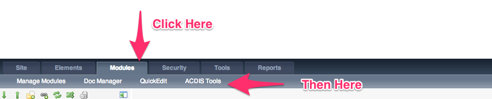
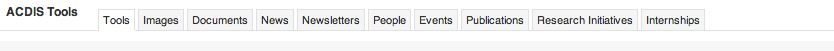
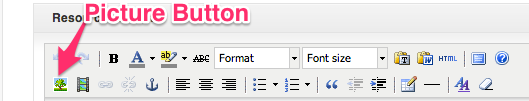
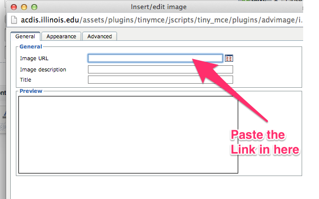

# DOCUMENTATION FOR ACDIS  WEBSITE WITH MODX
Hey, I'm Peixian Wang, student developer for spring 2014. The ACDIS website is a dynamically generated website with ModX as the backend, and there was absolutely no documentation for the website when I came in, so I decided to write one. In theory, this should always be on my [github account](https://github.com/6210xi/acdis_documentation), with git source control. However, this might may not hold in the future, so I'll leave a copy of this inside the server. If you're approaching this with a scorched earth tactic, don't worry about this and wipe the content. 

### How this is organized
I won't go into detail about how to use modx, you can find that information on the [modx site](http://rtfm.modx.com/). I will however, go into detail on individual changes I've made and things that you might need to use. 

###modX basics
ModX is organzized into various parts, with content in the left pane (I'll call it a "gutter"), a top navigation, and a main window. Here's an image of what I'm talking about (complete with terrible photoshopping): 

#### Gutter
The Gutter is where the actual content on the site resides, as in the child pages and parent pages. A child page is simply a page underneath the parent page. Think of it like the parent is the topic, and the child is the details. After you click on a page, it'll change the main window to the details view. You can use the Edit button to change the contents of the page. 

Note that you should <i>NOT</i> be using the source to edit pages! Instead go into edit mode and change the source from there. 
#### Editing
Hit the edit button, and you'll see this brought up: 

You have your standard WYSIWYG editor, with changing it into HTML if you need.
The stuff at the top is the metadata for the page, most pages have a URL alias, which is simply what the URL is. 

For example, the about ACDIS page has the URL alias, which means that the url for the webpage is going to be acdis.illinois.edu/aboutacdis.html If you changed the URL alias to "nginx4lyfe", the URL will be acdis.illinois.edu/nginx4lyfe.html
Uses temple will let you change the template of the page, change it according to what the content is. 
Everything else doesn't have that many use cases, but you can hover over the small dialog icon to find out more. 
###ACDIS TOOLS
This is the meat of the acdis website. To find it, go to Modules, then click on ACDIS tools.

You'll be greeted with a bunch of tabs like so: 

I'll go through the tabs one by one here:

1. "Tools" - As far as I can tell, this does actually nothing. 

2. "Images" - You'll probably find yourself here quite a bit. This is where you upload images and find these images. Each image is done using a item-identifier model, where the "item" is the image, and each image is assigned an ID number, the "identifier". To use the image later on, you'll need to find the ID of the image and use that. To add an image, click on "Add Image", where you'll be asked for an "Image Title", "Image Description", and the image itself. You don't need to actually have a title or description, but it's a good practice to enter a title along with a short description (where the image belongs, what's in the image, etc).

   To use images inside an article, you want to find the direct link of the image. To find that, search for the image you just uploaded, and you'll see a "link to image". Simply copy that link, go to your text editor, and click the picture button. 
   
   You'll be greeted with a prompt like this one:
   
   Just paste the link you copied in here, and your picture should show up. 
   ######FOR DEVELOPERS: I DID CHANGE THE HTML IN THE ACDIS TOOLS FOR THE IMAGES TO ACCOMMODATE THIS

3. "Documents" - This is specifically used for uploading documents (papers and other pdf's). Same model as the image, input a name, title, and description. Having a title and the filename may seem redundant, but they are different things, as the filename is the name on the server, while the title is the name that users will see. I don't suggest using the dropdown unless you really don't know the name of the file, it's large and unwieldy. 

4. "News" - Actually have no clue about this yet, need to fiddle around with it more. 

5. "Newsletters" - You can send newsletters to the entire listserv here, just input an email address to send it from and choose which recipient emails. 

6. "People" - Here you can edit the people group, which shows up on [the directory of people](http://acdis.illinois.edu/aboutacdis/directory.html). Again, dropdown is really long and not that useful, I suggest just using the search instead. Furthermore, there are several repeats of people, if you're editing a specific person that has multiple entries, I suggest finding the one that has the most information and deleting the rest. When you're adding a person, you'll see prompts for a bunch of information, most of which is self-explanatory. The most confusing thing is at the bottom of the page, where it asks you for a display order. Display order simply means the order of people in a particular group. For example, I was in the "Faculty Catagory" "Staff", and had a display order higher than Edward A. Kolodziej, meaning that I came after him in display order. It's important to note that the people manager won't actually let you put in publications until the person is added, so if you want to add a publication to a new person, add in the other information first, then use the search to find the person. You'll see input boxes for their publications in the right side.

7. "Events" - No clue.

8. "Publications" -  This is the stuff that you can add to a person or the front page. It follows the same idea as the people editor, but asks for a document ID. You don't need to fill in all the information, a bare minimum of a file to upload and a title is needed. Again, the publications uploader won't let you input authors until the publication is uploaded, so fill in all the information possible, then find the file with search and add in the authors. 

9. "Research Initiatives" - No clue, need to actually fix this.

10. "Internships" - No clue. 